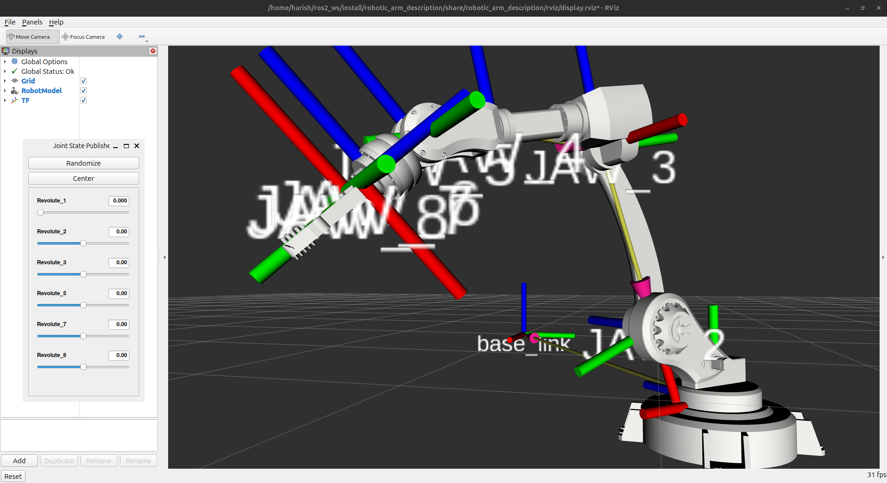

# RoboArm-M1: Design & Simulation of a 4-DOF Robotic Manipulator

<div align="center">


**BSERC Summer Internship 2025 — Robotics Domain**  
*IIITDM Kancheepuram | Project Code: ROBOT-M1*

</div>

---

## Overview

This project covers the complete design-to-simulation pipeline for a 4-DOF robotic manipulator arm — from CAD modeling in Fusion 360 to autonomous pick-and-place trajectory execution in RViz under ROS2 Jazzy.

The arm features **4 active revolute joints** (waist, shoulder, elbow, wrist) and a **parallel-jaw gripper**, implemented with Denavit-Hartenberg kinematic modeling, quintic polynomial trajectory planning, and full ROS2 integration.

---

## Demo

> 

---

## Project Phases

| Phase | Deliverable | Status |
|-------|-------------|--------|
| I — Virtual Modeling | Fusion 360 CAD → URDF export, RViz visualization | ✅ Done |
| II — Kinematic Solver | DH table, FK + IK with < 1mm error | ✅ Done |
| III — Task Planning | Quintic trajectory, pick-and-place simulation | ✅ Done |
| IV — Final Report | Documentation + video demo | 🔄 In Progress |

---

## Robot Specifications

| Parameter | Value |
|-----------|-------|
| DOF | 4 (arm) + 1 (gripper) |
| Joint types | Revolute (all) |
| Kinematics | Standard Denavit-Hartenberg |
| IK method | Numerical (Levenberg-Marquardt) |
| Trajectory | Quintic polynomial (zero vel/acc at endpoints) |
| Simulation | ROS2 Jazzy + RViz2 |
| CAD tool | Autodesk Fusion 360 |

---

## Denavit-Hartenberg Parameters

Derived directly from URDF joint origins:

| Joint | Maps to URDF | θ | d (m) | a (m) | α (rad) | Description |
|-------|-------------|---|--------|--------|---------|-------------|
| 1 | Revolute_1 | q₁ | 0.042 | 0.000 | π/2 | Waist rotation |
| 2 | Revolute_2 | q₂ | 0.000 | 0.365 | 0 | Shoulder pitch |
| 3 | Revolute_3 | q₃ | 0.246 | 0.048 | π/2 | Elbow pitch |
| 4 | Revolute_5 | q₄ | 0.115 | 0.000 | 0 | Wrist pitch |

> Revolute_4 and Revolute_6 are structurally fixed (limits = 0).  
> Revolute_7 and Revolute_8 are gripper fingers (symmetric, excluded from DH chain).

---

## Repository Structure

```
RoboArm-M1/
├── robotic_arm_description/       # ROS2 package
│   ├── urdf/                      # Robot description files
│   │   ├── robotic_arm.urdf.xacro # Top-level xacro entry point
│   │   └── assemblies/
│   │       └── robotic_arm.urdf.xacro  # Full robot definition
│   ├── meshes/robotic_arm/        # Visual (.dae) and collision (.stl) meshes
│   ├── launch/
│   │   ├── display.launch.py      # RViz visualization launch
│   │   └── gazebo.launch.py       # Gazebo simulation launch
│   ├── config/
│   │   └── ros2_controllers.yaml  # Controller configuration
│   ├── rviz/
│   │   └── display.rviz           # RViz config
│   ├── package.xml
│   └── CMakeLists.txt
├── scripts/
│   ├── fk_solver.py               # Forward kinematics (DH-based)
│   ├── ik_solver.py               # Inverse kinematics + round-trip test
│   └── trajectory_streamer.py     # Quintic pick-and-place streamer
├── docs/
│   ├── dh_parameters.md           # DH table derivation
│   ├── system_architecture.md     # Full system overview
│   └── images/                    # Screenshots and diagrams
├── requirements.txt
└── README.md
```

---

## Quick Start

### Prerequisites

- Ubuntu 24.04 LTS
- ROS2 Jazzy (installed and sourced)
- Python 3.12

### 1. Clone the repository

```bash
git clone https://github.com/Harish-Ram-R-V/RoboArm-M1
cd RoboArm-M1
```

### 2. Install Python dependencies

```bash
pip install -r requirements.txt
```

### 3. Build the ROS2 package

```bash
mkdir -p ~/ros2_ws/src
cp -r robotic_arm_description ~/ros2_ws/src/
cd ~/ros2_ws
colcon build --packages-select robotic_arm_description
source install/setup.bash
```

### 4. Launch RViz visualization

```bash
ros2 launch robotic_arm_description display.launch.py
```

### 5. Run Forward Kinematics

```bash
python3 scripts/fk_solver.py
```

### 6. Run Inverse Kinematics

```bash
python3 scripts/ik_solver.py
```

### 7. Run Pick-and-Place Simulation

Open RViz first (Step 4), then in a new terminal:

```bash
source ~/ros2_ws/install/setup.bash
python3 scripts/trajectory_streamer.py
```

Watch the arm perform the full autonomous pick-and-place sequence in RViz.

---

## Results

### Forward Kinematics

| Configuration | End-effector Position (x, y, z) m |
|---------------|-----------------------------------|
| Home (all zeros) | (0.413, -0.246, -0.073) |
| Reach forward [0°, 45°, -45°, 0°] | (0.306, -0.246, 0.185) |
| Reach sideways [90°, 60°, -30°, 45°] | (0.246, 0.306, 0.283) |

### Inverse Kinematics Accuracy

| Test | Position Error |
|------|---------------|
| Home position | 0.0000 mm ✓ |
| Reach forward | 0.0003 mm ✓ |
| Reach sideways | 0.0000 mm ✓ |

All errors well within the **< 1mm** project success metric.

---

## Trajectory Planning

The pick-and-place sequence uses **quintic polynomial interpolation** between joint-space waypoints:

```
s(τ) = 10τ³ - 15τ⁴ + 6τ⁵,   τ ∈ [0, 1]
```

This guarantees **zero velocity and zero acceleration** at each waypoint endpoint, producing smooth, jitter-free motion profiles suitable for physical deployment.

**Sequence:** Home → Pre-pick → Pick (gripper close) → Lift → Rotate → Place (gripper open) → Retreat → Home

---

## Dependencies

| Package | Version | Purpose |
|---------|---------|---------|
| ROS2 Jazzy | Latest | Robot middleware |
| roboticstoolbox-python | ≥ 1.0 | FK/IK computation |
| spatialmath-python | ≥ 1.0 | SE3 pose representation |
| numpy | ≥ 1.24 | Numerical computation |
| xacro | ROS2 Jazzy | URDF preprocessing |
| joint-state-publisher-gui | ROS2 Jazzy | RViz joint control |

---

## Acknowledgements

- **Program:** BSERC Summer Internship 2025 — Robotics Domain
- **CAD Export:** [fusion2URDF](https://github.com/Adriaeik/fusion2URDF) by Adriaeik
- **Kinematics Library:** [Robotics Toolbox for Python](https://github.com/petercorke/robotics-toolbox-python) by Peter Corke

---

## License

MIT License — see [LICENSE](LICENSE) for details.

---

<div align="center">
Made with ☕ at IIITDM Kancheepuram
</div>
