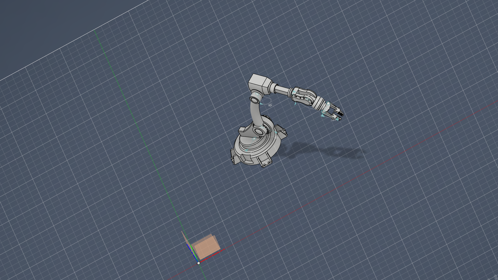

# robotic_arm — Robot Description



## Overview

| Property | Value |
|----------|-------|
| Total mass | 12.352 kg |
| Links | 9 |
| Joints | 8 (8 movable) |
| Assemblies | 1 |
| Root link | `base_link` |

## Table of Contents

- [Kinematic Tree](#kinematic-tree)
- [Link Properties](#link-properties)
- [Joint Properties](#joint-properties)
- [Assembly Breakdown](#assembly-breakdown)
- [Quick Start (ROS 2)](#quick-start-ros-2)
- [Files](#files)

## Kinematic Tree

```
base_link
  └─ Revolute_1 [revolute]
    JAW [BAKE]
      └─ Revolute_2 [continuous]
        JAW_2 [BAKE]
          └─ Revolute_3 [continuous]
            JAW_3 [BAKE]
              └─ Revolute_4 [revolute]
                JAW_4 [BAKE]
                  └─ Revolute_5 [continuous]
                    JAW_5 [BAKE]
                      └─ Revolute_6 [revolute]
                        JAW_6
                          └─ Revolute_7 [continuous]
                            JAW_7 [BAKE]
                          └─ Revolute_8 [continuous]
                            JAW_8 [BAKE]
```

## Link Properties

| Link | Mass (kg) | Material | Collision | Bodies |
|------|-----------|----------|-----------|--------|
| `JAW` | 2.5326 | ABS_Plastic | box | 1 |
| `JAW_2` | 1.0251 | ABS_Plastic | box | 1 |
| `JAW_3` | 1.5382 | ABS_Plastic | box | 1 |
| `JAW_4` | 0.6178 | ABS_Plastic | box | 1 |
| `JAW_5` | 0.3547 | ABS_Plastic | box | 1 |
| `JAW_6` | 0.0811 | ABS_Plastic | box | 1 |
| `JAW_7` | 0.0415 | ABS_Plastic | box | 1 |
| `JAW_8` | 0.0415 | ABS_Plastic | box | 1 |
| `base_link` | 6.1197 | ABS_Plastic | cylinder | 1 |

## Joint Properties

| Joint | Type | Parent → Child | Axis | Limits |
|-------|------|---------------|------|--------|
| `Revolute_1` | revolute | `base_link` → `JAW` | (-0,-1,-0) | [0.0°, 360.0°] |
| `Revolute_2` | continuous | `JAW` → `JAW_2` | (-0,0,-1) | — |
| `Revolute_3` | continuous | `JAW_2` → `JAW_3` | (-1,0,-0) | — |
| `Revolute_4` | revolute | `JAW_3` → `JAW_4` | (0,-1,0) | [0.0°, 0.0°] |
| `Revolute_5` | continuous | `JAW_4` → `JAW_5` | (-0,-1,-0) | — |
| `Revolute_6` | revolute | `JAW_5` → `JAW_6` | (0,-1,0) | [0.0°, 0.0°] |
| `Revolute_7` | continuous | `JAW_6` → `JAW_7` | (-1,-0,-0) | — |
| `Revolute_8` | continuous | `JAW_6` → `JAW_8` | (1,0,0) | — |

## Assembly Breakdown

### robotic_arm

- **Links**: JAW, JAW_2, JAW_3, JAW_4, JAW_5, JAW_6, JAW_7, JAW_8, base_link
- **Total mass**: 12.352 kg

## Quick Start (ROS 2)

```bash
# 1. Copy package to your ROS 2 workspace
cp -r robotic_arm_description ~/ros2_ws/src/

# 2. Build
cd ~/ros2_ws
colcon build --packages-select robotic_arm_description
source install/setup.bash

# 3. Visualize in RViz2
ros2 launch robotic_arm_description display.launch.py

# 4. Validate URDF structure
check_urdf install/robotic_arm_description/share/robotic_arm_description/urdf/robotic_arm.urdf

# 5. Print kinematic tree
urdf_to_graphviz install/robotic_arm_description/share/robotic_arm_description/urdf/robotic_arm.urdf
```

**Joint control**: The launch file includes `joint_state_publisher_gui` —
use the sliders to move revolute/prismatic joints in RViz2.

**Topic inspection**:
```bash
# See published joint states
ros2 topic echo /joint_states

# See robot description parameter
ros2 param get /robot_state_publisher robot_description
```

## Files

| Path | Description |
|------|-------------|
| `urdf/robotic_arm.urdf.xacro` | Top-level xacro (entry point) |
| `urdf/robotic_arm.urdf` | Flat URDF (for validation) |
| `urdf/assemblies/` | Per-assembly xacro macros |
| `meshes/` | Visual (OBJ) and collision (STL) meshes |
| `launch/display.launch.py` | Launch robot_state_publisher, RViz, and generated controllers |
| `config/joint_state.yaml` | Joint state publisher config |
| `config/ros2_controllers.yaml` | Generated ros2_control controller manager config |
| `robot_data.yaml` | Supplementary data (beyond URDF) |
| `docs/transforms.md` | Transformation matrices (KaTeX) |

## Customizing

Assemblies tagged `!dummy_` are designed to be swapped out. To replace one:

1. Create your replacement as a xacro macro with the same interface
2. Place it in `urdf/assemblies/`
3. Update the `<xacro:include>` in `urdf/robotic_arm.urdf.xacro`
4. Update meshes in `meshes/<your_assembly>/`

The xacro prefix system (`${prefix}`) ensures link names stay unique
when multiple instances of the same assembly are used.

---
*Generated by Fusion URDF/XACRO Exporter v3.0.0*